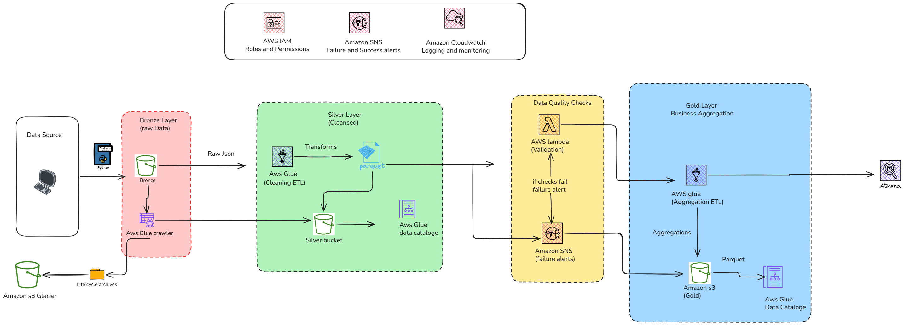

# Open LakeHouse for East Africa Agricultural Market Data

A cloud-native, end-to-end agricultural **Lakehouse Data Platform** built on AWS that ingests, validates, transforms, and aggregates agricultural data across East Africa using a **Medallion Architecture (Bronze → Silver → Gold)**.



The project simulates real-world agricultural datasets including:

- Weather Data  
- Crop Growth Data  
- Farmer Profiles  
- Field & Soil Data  

The platform transforms raw agricultural datasets into **analytics-ready business datasets** for agricultural intelligence, climate-smart farming, and decision-making.

---

# Table of Contents

- [Project Overview](#project-overview)
- [Architecture](#architecture)
- [Key Features](#key-features)
- [Tech Stack](#tech-stack)
- [Project Structure](#project-structure)
- [Data Flow](#data-flow)
- [Bronze Layer](#bronze-layer)
- [Silver Layer](#silver-layer)
- [Gold Layer](#gold-layer)
- [Data Quality Validation](#data-quality-validation)
- [AWS Services Used](#aws-services-used)
- [Step Function Orchestration](#step-function-orchestration)
- [Data Model](#data-model)
- [Partition Strategy](#partition-strategy)
- [How to Run the Project](#how-to-run-the-project)
- [Athena Queries](#athena-queries)
- [Future Improvements](#future-improvements)
- [Resume Highlights](#resume-highlights)
- [Author](#author)

---

# Project Overview

This project simulates a **production-grade agricultural data platform** for East African agricultural intelligence.

The platform:

1. Generates realistic agricultural datasets
2. Stores raw data in an AWS Bronze layer
3. Cleans and transforms data into a Silver layer
4. Performs automated data quality checks
5. Produces business-ready aggregations in a Gold layer
6. Makes datasets queryable using Amazon Athena
7. Sends failure notifications using SNS alerts

The architecture follows the **Lakehouse + Medallion Architecture Pattern** commonly used in modern enterprise data platforms.

---

# Architecture

## High-Level Architecture

```text
Synthetic Agricultural Data
            │
            ▼
      Python Data Generator
            │
            ▼
        Amazon S3 Bronze
        (Raw JSON Data)
            │
            ▼
       AWS Glue Crawler
            │
            ▼
     AWS Glue ETL Jobs
      Bronze → Silver
            │
            ▼
      AWS Lambda Checks
      (Data Validation)
            │
      ┌─────┴────────┐
      │              │
Validation Pass   Validation Fail
      │              │
      ▼              ▼
Silver → Gold     Amazon SNS Alert
Aggregation
      │
      ▼
 Amazon S3 Gold Layer
      │
      ▼
 AWS Glue Catalog
      │
      ▼
   Amazon Athena
```

### Pipeline Architecture

The system follows a **Medallion Data Architecture**:

```text
Bronze Layer → Silver Layer → Gold Layer
 Raw Data       Cleaned Data    Business Aggregates
```

---

# Key Features

### Data Generation
- Synthetic East African agricultural data generation
- Realistic weather simulation
- Farmer profile generation
- Soil & field metrics simulation
- Crop growth tracking

### Medallion Architecture
Implements:

- **Bronze Layer** → Raw data storage
- **Silver Layer** → Cleaned & transformed data
- **Gold Layer** → Business analytics datasets

### Data Engineering Features
- Schema validation
- Deduplication
- Glue Catalog registration
- Partition management
- PySpark transformations
- Step Function orchestration
- Retry mechanisms
- Failure alerting via SNS

---

# Tech Stack

| Category | Technology |
|----------|-------------|
| Cloud Platform | AWS |
| Storage | Amazon S3 |
| ETL | AWS Glue |
| Big Data Processing | PySpark |
| Workflow Orchestration | AWS Step Functions |
| Validation | AWS Lambda |
| Query Engine | Amazon Athena |
| Metadata | AWS Glue Catalog |
| Notifications | Amazon SNS |
| Programming Language | Python |
| File Format | JSON, Parquet |
| Compression | Snappy |

---

# Project Structure

```text
Open LakeHouse for EastAfrica Agricultural market Data/
│
├── Glue_Jobs/
│   ├── bronze_silver_transformation.py
│   └── silver_gold_aggregation.py
│
├── ingestion/
│   ├── __init__.py
│   ├── east_africa_agriculture_dict.json
│   ├── generate_data.py
│   └── s3_ingestion.py
│
├── Lambda_functions/
│   └── data_quality_function.py
│
├── step_functions/
│   └── pipeline_orchestration.json
│
├── Validation/
│   ├── crop_growth_schema.py
│   ├── daily_weather_schema.py
│   ├── farmer_data_schema.py
│   └── field_data_schema.py
│
├── IAM Permission/
│   ├── open-lakehouse-agriculture-glue-role.json
│   ├── open-lakehouse-agriculture-lambda-role.json
│   └── open-lakehouse-agriculture-step-function-role.json
│
├── testing/
│   └── generate_data_test.py
│
├── requirements.txt
├── README.md
└── information.MD
```

---

# Data Flow

The project processes agricultural data through three layers.

```text
Generate Data
      ↓
S3 Bronze Layer
      ↓
Glue Crawler
      ↓
Bronze → Silver Transformation
      ↓
Lambda Data Quality Checks
      ↓
Silver → Gold Aggregation
      ↓
Athena Query Layer
```

---

# Bronze Layer

The Bronze layer stores **raw agricultural data** exactly as generated.

Data is ingested into Amazon S3 as **JSON** files.

Datasets include:

### Weather Data
Contains:

- Temperature
- Rainfall
- Humidity
- Soil moisture
- Evapotranspiration

### Crop Growth Data
Contains:

- Crop type
- Growth stage
- Health score
- Plant height
- Yield estimation

### Farmer Data
Contains:

- Farm size
- Farming practice
- Irrigation method
- Technology adoption
- Crops grown

### Field/Soil Data
Contains:

- Soil pH
- Nitrogen
- Potassium
- Organic matter
- Drainage class

---

# Partition Strategy

All Bronze datasets are partitioned consistently:

```text
country/
city/
year/
month/
day/
```

Example:

```text
s3://agriculture-bronze/weather/
country=Kenya/
city=Nairobi/
year=2026/
month=05/
day=21/
```

This improves:

- Query performance
- Cost optimization
- Faster partition pruning
- Better Athena performance

---

# Silver Layer

The Silver layer contains **cleaned and transformed agricultural datasets**.

Transformations are done using **AWS Glue + PySpark**.

## Weather Transformation

Derived metrics:

### Temperature Conversion
Converts Celsius → Fahrenheit

### Crop Suitability Score
Calculated using:

- Temperature
- Rainfall
- Soil moisture

### Heat Stress Index

Categories:

- High
- Moderate
- Low

### Water Stress Level

Categories:

- Water Deficit
- Balanced
- Water Surplus

---

## Crop Growth Transformation

Derived metrics:

### Growth Efficiency
Calculated using:

```text
health_score / day_after_planting
```

### Yield Category

Categories:

- High Yield
- Medium Yield
- Low Yield

---

## Farmer Profile Transformation

Derived metrics:

### Tech Adoption Score

Calculated using:

- Mobile ownership
- Weather app usage
- Extension services

### Farmer Classification

Categories:

- Smallholder
- Medium
- Large

---

## Field/Soil Transformation

Derived metrics:

### Soil Fertility Score
Calculated using:

- Soil pH
- Nitrogen
- Organic matter

### Soil Health Category

Categories:

- Good
- Moderate
- Poor

---

# Gold Layer

The Gold layer contains **business-level analytics tables**.

Example analytics:

### Weather Analytics
- Weather trends by region
- Heat stress patterns
- Rainfall analysis

### Crop Analytics
- Crop performance
- Yield trends
- Growth efficiency tracking

### Farmer Analytics
- Farmer segmentation
- Technology adoption patterns

### Soil Analytics
- Soil fertility insights
- Soil degradation monitoring

Data format:

```text
Parquet + Snappy Compression
```

---

# Data Quality Validation

AWS Lambda validates Silver layer datasets before Gold aggregation.

Checks include:

| Validation | Purpose |
|------------|---------|
| Null Checks | Missing values |
| Schema Validation | Correct structure |
| Duplicate Checks | Remove duplicates |
| Freshness Checks | Latest data validation |
| Business Rules | Agricultural thresholds |

If validation fails:

```text
SNS Notification Sent
Pipeline Stops
```

---

# AWS Services Used

## Amazon S3
Used for:

- Bronze storage
- Silver storage
- Gold storage

---

## AWS Glue

Used for:

- Crawlers
- ETL transformations
- Metadata registration

---

## AWS Lambda

Used for:

- Data quality validation
- Schema validation
- Monitoring

---

## AWS Step Functions

Used for orchestration.

Workflow:

```text
1. Run Bronze Crawler
2. Bronze → Silver Glue Job
3. Data Quality Validation
4. Silver → Gold Glue Job
5. Send SNS Notification
```

Features:

- Retry logic
- Failure handling
- Parallel execution
- Error tracking

---

## Amazon SNS

Used for:

- Failure alerts
- Pipeline notifications

---

## Amazon Athena

Used for querying Gold datasets.

Example:

```sql
SELECT *
FROM weather_gold
LIMIT 10;
```

---

# Data Model

## Weather Dataset

Contains:

- temperature
- humidity
- rainfall
- evapotranspiration
- soil moisture

Partitioning:

```text
country/city/year/month/day
```

---

## Crop Dataset

Contains:

- crop_type
- growth_stage
- health_score
- yield estimation

Partitioning:

```text
country/city/year/month/day
```

---

## Farmer Dataset

Contains:

- farm_size
- irrigation_type
- farming_practice

Partitioning:

```text
country/city/year/month/day
```

---

## Field Dataset

Contains:

- soil_ph
- nitrogen_ppm
- potassium_ppm
- organic_matter

Partitioning:

```text
country/city/year/month/day
```

---

# How to Run the Project

## 1. Install Dependencies

```bash
pip install -r requirements.txt
```

---

## 2. Generate Agricultural Data

```bash
python ingestion/generate_data.py
```

---

## 3. Upload to S3 Bronze Layer

```bash
python ingestion/s3_ingestion.py
```

---

## 4. Run Glue Crawler

Run crawler:

```text
agriculture-bronze-crawler
```

---

## 5. Execute Step Function

Start pipeline:

```text
agriculture-open-lakehouse-step-function
```

---

## Athena Queries

### Weather Analysis

```sql
SELECT country,
AVG(avg_temperature_celsius)
FROM weather_transformed
GROUP BY country;
```

### Crop Yield Analysis

```sql
SELECT crop_type,
AVG(estimated_yield_tons_per_hectare)
FROM crop_growth_transformed
GROUP BY crop_type;
```

### Farmer Segmentation

```sql
SELECT farmer_classification,
COUNT(*)
FROM farmer_profiles_transformed
GROUP BY farmer_classification;
```

---

# Future Improvements

Planned enhancements:

- Apache Airflow orchestration
- Apache Kafka streaming
- Real-time ingestion
- Delta Lake / Apache Iceberg
- ML-based yield prediction
- Power BI / QuickSight dashboards

---


# Author

## Breta Osodo

Data Engineer focused on building scalable cloud-native data platforms using AWS, PySpark, and modern data engineering practices.